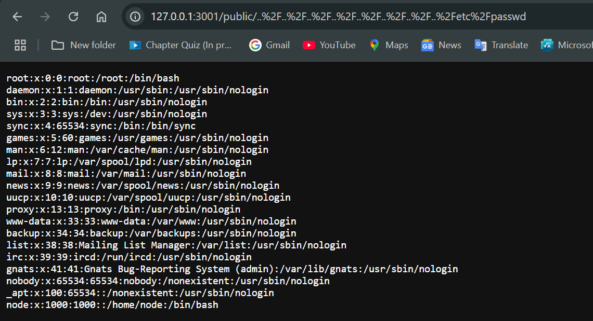

# Lab 11: Using Snyk to Find & Fix Vulnerabilities
## 1. Introduction
### What is Snyk and why is it important?
Snyk is a developer-first security platform that helps identify and fix vulnerabilities in code, open-source dependencies, container images, and infrastructure as code (IaC). It enables developers to find and remediate security issues early in the development lifecycle, without slowing down the development process.

By integrating Snyk into the software development pipeline, teams can benefit from:

- **Automated vulnerability scanning** during coding, testing, and deployment.
- **Real-time feedback** on insecure dependencies or misconfigurations.
- **Fix recommendations and pull requests** that help resolve issues quickly.
- **Support for CI/CD integration**, enabling continuous security checks.
- **Detailed reporting and dashboards** for monitoring project health.

Using Snyk improves an organization’s security posture by shifting security left—addressing vulnerabilities earlier, where fixes are faster and less costly.

### Review the BlitzProp challenge: what security issues are being addressed?
The BlitzProp challenge highlights critical security vulnerabilities commonly found in JavaScript applications, specifically:

**1. Prototype Pollution**
The app improperly merges user input into objects using functions like Object.assign() without validating or sanitizing the input. This allows an attacker to manipulate the JavaScript object prototype by injecting properties via the special __proto__ key. As a result, global objects can be polluted, causing unauthorized access or behavior changes throughout the application.

**2. Vulnerable Dependencies**
BlitzProp relies on outdated versions of the flat npm package, which is susceptible to prototype pollution vulnerabilities (Snyk ID: SNYK-JS-FLAT-596927). It also uses the pug template engine with known remote code execution risks (Snyk ID: SNYK-JS-PUG-1071616).

**3. Lack of Input Validation**
User inputs are directly processed without proper sanitization, allowing exploits such as prototype pollution and template injection, which can lead to unauthorized file access or remote code execution.

Together, these issues enable attackers to bypass security controls, access sensitive data (like hidden flag files), and potentially execute arbitrary code, demonstrating the importance of secure coding practices and dependency management.

## 2. Steps Performed
### Setup Goof App
#### Description

In this step, I set up the Goof vulnerable application, which is an intentionally insecure Node.js app created by Snyk to demonstrate how common vulnerabilities in open-source dependencies can be found and fixed.

#### Commands Used

```bash
# Clone the Goof GitHub repository
git clone https://github.com/snyk/nodejs-goof.git

# Exploration
cd nodejs-goof
ls

# Start the application
docker-compose up --build

# Web access
http://localhost:3001
```

### Docker Image Scanning

#### Description

In this step, I used the Snyk CLI to scan the Docker image built for the Goof application. The goal was to identify vulnerabilities in the base system libraries.

#### Commands Used

```bash
# Step into the project directory
cd nodejs-goof

# Build the Docker image using docker-compose
docker-compose build

# List available Docker images to confirm the Goof image was built
docker images

# Run a Snyk scan on the Docker image
snyk test --docker nodejs-goof_goof --file=Dockerfile
```

**Results**
[Results](snyk-scan-results.txt)

### Manual Exploits

#### Description

In this step, I tested the Goof application for a Local File Inclusion (LFI) vulnerability by attempting to access the system's `/etc/passwd` file through the browser. I also explored the provided PoC (proof-of-concept) exploits in the `exploits/` directory to understand how vulnerabilities can be reproduced through scripts.

#### Test the App Locally: Access `/etc/passwd`

##### Steps Performed

1. Started the Goof app:
```bash
    docker-compose up --build
```
Opened the app in a browser at:

cpp

http://127.0.0.1:3001

Manually crafted and accessed this LFI URL in the browser:

http://127.0.0.1:3001/public/..%2F..%2F..%2F..%2F..%2F..%2F..%2F..%2Fetc%2Fpasswd

**Result**

The /etc/passwd file contents were successfully displayed in the browser, confirming that the application is vulnerable to LFI.

**Output:**
```bash
root:x:0:0:root:/root:/bin/bash
daemon:x:1:1:daemon:/usr/sbin:/usr/sbin/nologin
bin:x:2:2:bin:/bin:/usr/sbin/nologin
sys:x:3:3:sys:/dev:/usr/sbin/nologin
sync:x:4:65534:sync:/bin:/bin/sync
games:x:5:60:games:/usr/games:/usr/sbin/nologin
man:x:6:12:man:/var/cache/man:/usr/sbin/nologin
lp:x:7:7:lp:/var/spool/lpd:/usr/sbin/nologin
mail:x:8:8:mail:/var/mail:/usr/sbin/nologin
news:x:9:9:news:/var/spool/news:/usr/sbin/nologin
uucp:x:10:10:uucp:/var/spool/uucp:/usr/sbin/nologin
proxy:x:13:13:proxy:/bin:/usr/sbin/nologin
www-data:x:33:33:www-data:/var/www:/usr/sbin/nologin
backup:x:34:34:backup:/var/backups:/usr/sbin/nologin
list:x:38:38:Mailing List Manager:/var/list:/usr/sbin/nologin
irc:x:39:39:ircd:/run/ircd:/usr/sbin/nologin
gnats:x:41:41:Gnats Bug-Reporting System (admin):/var/lib/gnats:/usr/sbin/nologin
nobody:x:65534:65534:nobody:/nonexistent:/usr/sbin/nologin
_apt:x:100:65534::/nonexistent:/usr/sbin/nologin
node:x:1000:1000::/home/node:/bin/bash
```

#### Explore PoCs in `exploits/` Directory
To understand how the Goof application is vulnerable, I explored the provided (PoC) scripts located in the `exploits/` directory.

I focused on the script `nosql-exploits.sh`, which contains multiple examples of NoSQL Injection payloads targeting the login functionality.

##### Commands Used:

```bash
# Navigating to the exploits directory
cd ~/nodejs-goof/exploits

# Reading the PoC script to understand payloads
cat nosql-exploits.sh

# Manually running the NoSQL Injection payload (ns4)
echo '{"username": "admin@snyk.io", "password": {"$gt": ""}}' | http --json http://localhost:3001/login -v
```

### Email Evidence


### Rebuild & Validate Fix


### Rebuild & Validate Fix


### CTF Challenge - BlitzProp


### Prototype Pollution


## Screenshots

#### Snyk scan results


### Goof app running


### Terminal showing snyk wizard interaction


### Browser views before/after fix


### Snyk dashboard or email report


### Docker container details


### Network tab activity from browser


### Exploit script execution output
